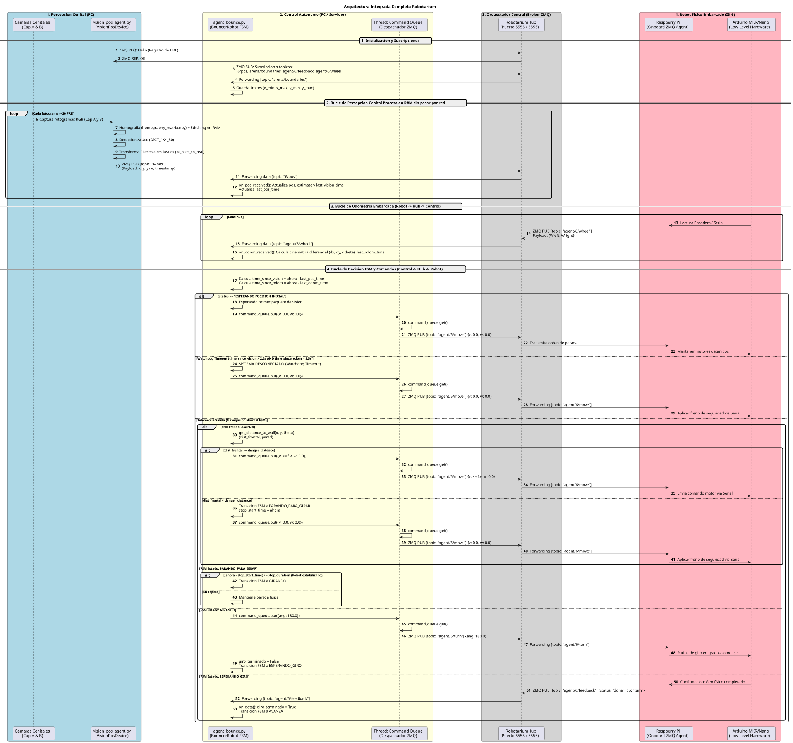
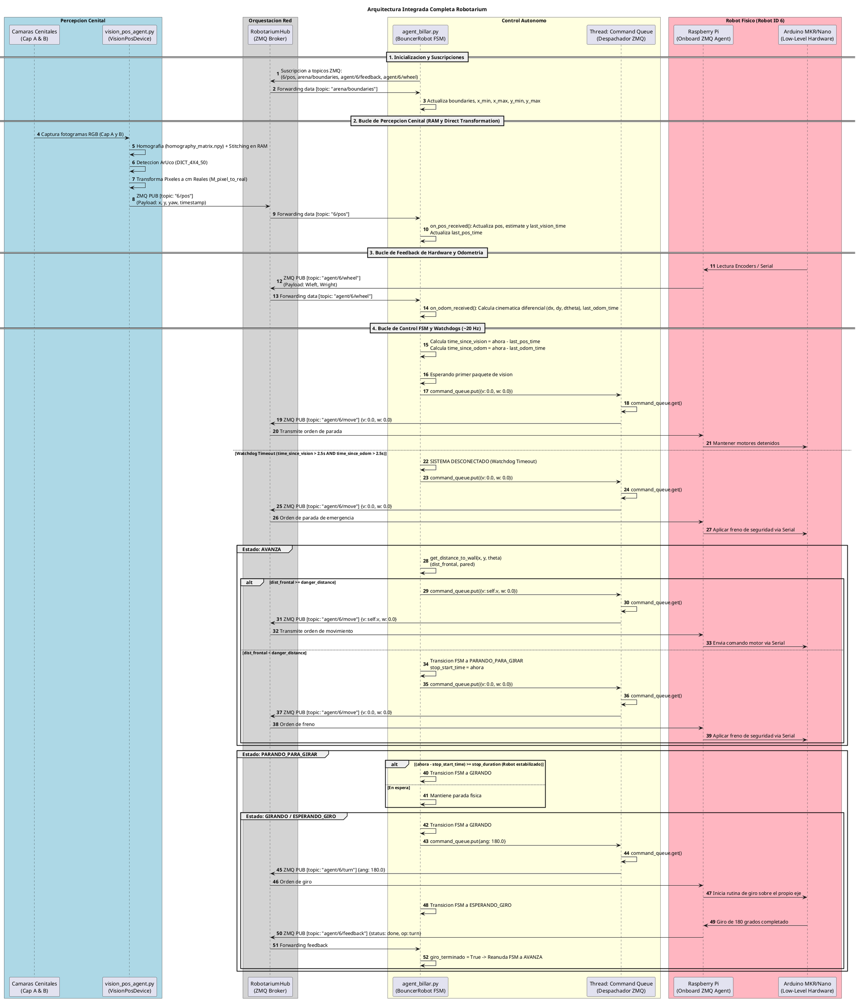

# 🤖🛰️ Robotarium Ecosystem: Distributed Low-Latency Multi-Agent Testbed

## 📋 Descripción del Proyecto

**Robotarium Ecosystem** es una plataforma modular, distribuida y de baja latencia diseñada para la orquestación, telemetría y control autónomo de flotas de micro-robots móviles en entornos de pruebas cerrados. El sistema unifica la percepción espacial mediante **visión cenital global con homografía en memoria RAM** y desacopla la comunicación mediante una arquitectura híbrida basada en **ZeroMQ** y **MQTT**.

---

## 🏛️ Orígenes y Atribución Académica

Este repositorio y su arquitectura amplían, refactorizan y optimizan la infraestructura original del **Robotarium** desarrollada en el **Departamento de Arquitectura de Computadores y Automática (DACyA)** de la Universidad Complutense de Madrid (UCM), en estrecha colaboración con las líneas de investigación del grupo **ISCAR** (*Systems Engineering, Control, Automation and Robotics*).

* **Línea Base Original:** Banco de pruebas experimental del DACyA / UCM para el estudio de control de robots móviles, sistemas multi-agente (*MAS*) y validación de algoritmos de navegación sin GPS mediante sensores virtuales cenitales.
* **Evolución y Rediseño Actual:** Optimización del pipeline de visión computacional (eliminación de cuellos de botella por transporte de vídeo Base64 en red), incorporación de una máquina de estados finitos (FSM) segura entre hilos con *watchdogs* de desconexión y estandarización de tópicos de telemetría individualizada por agente.

---

## 🏗️ Arquitectura del Sistema

El ecosistema opera dividiendo las responsabilidades en capas estrictamente desacopladas para garantizar determinismo y tiempos de respuesta inferiores a $30\text{ ms}$:

1. **Percepción Cenital Integrada (`vision_pos_agent.py`):** Captura flujos de vídeo de múltiples cámaras, aplica un proceso de costura (*stitching*) mediante una matriz de homografía $3 \times 3$ almacenada localmente (`homography_matrix.npy`), detecta marcadores ArUco y transforma píxeles a centímetros reales utilizando los límites del tatami (`tatami_config.json`). Todo el procesamiento ocurre en RAM, publicando directamente la posición y orientación de cada agente en tópicos individuales `{robot_id}/pos`.
2. **Orquestación Central (`robotarium_hub.py`):** Actúa como el *broker* central de red gestionando conexiones mediante sockets ZeroMQ (`PUB/SUB` y `REP/REQ`). Un único *event loop* (`zmq.Poller`) multiplexa de forma eficiente la retransmisión de datos de toda la flota.
3. **Control Autónomo y FSM (`agent_billar.py` / `agent_bounce.py`):** Clientes de misión inteligentes que gestionan la evasión de paredes y límites espaciales mediante una Máquina de Estados Finitos segura basada en colas thread-safe (`command_queue`), integrando sistemas de seguridad ante la pérdida temporal de telemetría (*watchdog* de $2.5\text{ s}$).

---

## 📊 Diagrama de Secuencia de la Arquitectura Integrada

A continuación se detalla el flujo completo de interacción entre los subsistemas, incluyendo los bucles de percepción, odometría, despacho seguro mediante cola y la máquina de estados con *watchdogs*:




---

## 🚀 Guía de Despliegue Rápido

1. **Instalación de Dependencias:**
```bash
pip install pyzmq paho-mqtt opencv-python numpy

```


2. **Orden de Ejecución de Nodos en el Laboratorio:**
* **Paso 1:** Iniciar el orquestador central de red:
```bash
python3 robotarium_hub.py

```


* **Paso 2:** Iniciar el sistema unificado de visión y posicionamiento:
```bash
python3 vision_pos_agent.py --no-gui

```


* **Paso 3:** Lanzar el cliente autónomo de navegación para el robot objetivo:
```bash
python3 agent_billar.py

```


---

## 🧠 Roadmap: Inclusión de IA Avanzada (Próximamente)

*Este apartado se encuentra en fase de diseño estratégico y definición de especificaciones técnicas:*

* **Percepción Dinámica por Edge AI:** Sustitución o refuerzo del seguimiento por ArUco mediante modelos ligeros de detección de objetos en el borde (YOLOv11-Nano / ByteTrack) para la identificación de blancos móviles y dinámicos en entornos sin GPS (*GPS-Denied*).
* **Planificación Multi-Agente con GNN y CBF:** Evolución de la navegación reactiva hacia un planificador global basado en Redes Neuronales de Grafos (GNN) y Funciones de Barrera de Control (*Control Barrier Functions - CBF*) para la optimización de flotas de alta densidad y prevención de bloqueos mutuos (*deadlocks*).
* **Autonomía Compartida y Teleoperación con Retardo:** Integración de un árbitro inteligente (`twist_mux`) capaz de combinar mandos remotos con simulación de latencia espacial y anulación autónoma ante riesgos inminentes de colisión.
